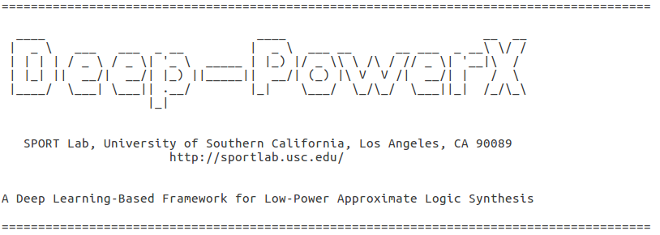

Note:
- Deep-PowerX should run on any version of Linux.

## Abstract
This paper works at integrating three popular approaches namely Deep Learning, Approximate Computing, and Low Power Design into a strategy to optimize logic at the synthesis level. This is because of the high complexity, but also the proven impact of logic synthesis and approximate computing in reducing the total power consumption of digital circuits. We have utilized advances in deep learning to guide a synthesis engine to minimize the total switching power (as the main source of power dissipation in CMOS technology) for a given digital circuit, subject to a predetermined error rate at the primary outputs. Our framework, Deep-PowerX, focuses on replacing or removing gates on a post technology mapped network and uses a deep neural network to predict error rates at primary outputs of the circuit when a specific part of the netlist is approximated, reducing the exponential time complexity of standard approximate logic synthesis to linear time.
The approximation algorithm in Deep-PowerX aims to first reduce the total switching power and then follows up with additional area reduction iterations. Experiments are done on many open source benchmark circuits. Results show significant reduction in power and area by up to $1.47\times$ and $1.43\times$ compared to exact solutions and by up to 22\% and 27\% compared to state-of-the-art approximate logic synthesis tools while having orders of magnitudes less run-time.

## Installation
- Make sure that you are using python3.6 or newer (written using python 3.6.7)
- Install pip using the following: `sudo apt install python3-pip`
- Install required packages using the following: `pip3 install -r requirements.txt`

Type './als' to run the als executable

## Recompiling ABC:
ALS utilizes Berkeley's open-source synthesis tool "ABC" as a base platform for initial exact technology mapping and feature extraction.
The modified version of ABC is compiled, but to re-compile ABC type 'make clean' and then 'make'.

## Example
`[~/als, master+25]: ./als` 
`Using TensorFlow backend.` 
`USC Approximate Logic Synthesis Suite v1.0` 
`For a list of commands, please type "help"` 
`als > map_approx benchfolder/ISCAS85/c1196.bench 0.05` 
`.` 
`.` 
`.` 

 

## File Definitions:

### als.py
##### execute by calling ./als
This file acts as a wrapper for the entire project. The aim here was to provide a user
interface that is similar to other popular terminal synthesis tools such as Design Compiler
and ABC. Here the user will be able to type something as simple as train_dnn, map_approx,
map_exact, write_blif… along with their respective arguments and the als file will direct
the command to the correct files to execute the user’s design intentions. Type "help" for a
list of commands.

### node_extract.py
This file is responsible for taking the custom original.bench file after it has been mapped
and extracting the nodes and edges of the logic network. It then takes the nodes and
edges and stores them into two files (node_edges.txt and node_types.txt) which enables
other files to be able to load in a mapped network into a traditional graph format.

### error_control.py
This file is responsible for first loading a mapped network and then producing realistic
training data for the DNN. The pseudocode is as follows:

##### PSEUDOCODE for error_control.py
-- Read in original.bench to error_control.py\
---- For all nodes (n)\
------ Randomly replace (100%, 90%, 80% … 0%) of prior network with respect to node (n) // including current level\
-------- Replace node (n) with (m) approximations where (m) is the number of similar input gates in technology library\
---------- Call node_extract.py // rewrites the original.bench and convert to nodes, edges, and local errors\
---------- Call errors.cpp with nodes edges and local errors\
---------- Prepend final_error and intrinsic error calc to the specified vector of features in node_features.txt\

### extract_all_features.py
We needed a way to be able to iterate the error_control.py training data generation over
any specified files automatically and extract_all_features.py does this. This file will prepare
the necessary files for error_control.py to operate as well as do this for any .bench or .blif
files within the user specified directory. This enables the user to train easily by simply
placing the .bench or .blif files in a “training” directory.

##### PSEUDOCODE for extract_all_features.py
-- for all .bench or .blif files in specified training directory\
---- prepare graph network for error_control\
---- run error_control.py\

### synthesisEngine.py
This file is a synthesis class that provides many support functions for the approximate
logic synthesis flow. We decided to implement these methods from scratch as we could
have full control over the use of the methods and the integration into the approximate
network replacement algorithm

A few of the implemented methods are listed and act as support for the ALS framework:
- loadLibraryStats()
    + Loads tech library
- loadNetwork()
    + Loads in the mapped network
- reset()
    + Resets the class
- loadFeatures()
    + Loads Features of the network from train_data.txt (does this once)
- getNumLookup()
    + Returns an encoded number for a gate type
- updateFeature()
    + Updates the specif feature of the node if the node has been modified
- genFeature()
    + Generates a Feature Vector for the DNN to utilize -> for predicting error rate
- levelToFlat()
    + Converts the network stored level by level to topological order (deep copy)
- printGates()
    + Prints status about the makeup of the network and the area contribution of each type of
      gate
- printStatus()
    + Prints the status of the network such as current_error, current_area, current_delay, and
      current_critical_path
- printDelay()
    + Prints the max delay node at each level
- printCritPath()
    + Prints the critical delay and the nodes that contribute to the critical path
- calcArea()
    + Calculates the area of the network
- calcDelay()
    + Calculates the delay of the network
- getCritPath()
    + Gets the critical path and returns a list of nodes that contribute to the critical path.
- writeNodeTypes()
    + Writes the current node structure to node_types.txt
- writeGateError()
    + Writes the current local error of each node to gate_error.txt
- calcOutputError()
    + Calculates the error rate of the network (done in C++)
- getErrors()
    + Gets the error of each output of the network (done in C++)
- dnnGetError()
    + Utilizes a DNN to predict the error rate in constant time
    + Utilizes a Calibration technique realign the predicted error of the DNN
- getIntrinsic()
    + Given two gates the function returns the intrinsic error (normalized difference in truth tables)
- optArea()
    + Given a gate the function returns the best gate in terms of area savings / intrinsic error introduction
- approxSynth()
    + Optimizes the network for delay while maintaining output error lower than the user constraint.
- areaClean()
    + Optimizes the network for area while maintaining output error lower than the user constraint.

### synthesisDriver.py
This file acts as a testing environment for the synthesisEngine class

### blif_to_custom_bench.py
The python script takes the .blif and generates this custom .bench file to then be read
into node_extract.py for network approximation and error calculations using error.cpp.

### custom_bench_to_blif.py
This file converts the approximated original.bench file to a user specified name with a .blif
format restriction (as .blif is a friendly file format where the nodes are inherently
technology mapped). This will enable the user to provide an unmapped file format and
receive an approximated circuit that is also technology mapped.

### data_to_npz.py
This file is responsible for reading in the training data after being produced by
extract_all_nodes.py. The file then strips and formats the data to be understood by the
DNN. The file is also responsible for data normalization.

### error.cpp
This file’s responsibility is to traverse the network and provide the final global MHD (maximum hamming distance or error) 
The code utilizes boolean difference calculus to insert and propagate error through any arbitrary network.

- Input/output files:
  - Two files are generated by node_extract.py, which provide node information
(node_types.txt) and edges between nodes (node_edges.txt).
  - The third file (gate_error.txt) is generated by error_control.py and describes
the intrinsic error (Eg) per node. 
 

After execution, error.cpp writes the calculated global MHD to final_error.txt based on
the approximated nodes.
Implementing multi-input gates like some complex gates (i.e. oai22) found inside the
technology library requires some practical considerations. In order to propagate error
through a multi-input gate, we decompose each multi-input gate into a tree-structure of
smaller known gates and propagate the error internally. Each sub-gate inside the exact
tree-structure have their own Eg (intrinsic error) that is replaced by the correspondent approximate Eg',
thus we need to provide the intrinsic gate error Eg by comparing truth tables of exact and
approximate gates for each sub-gate respectively and propagating the total error to the
output of the complex gate. The probability of ones and the error propagation at the end
of the node is recorded and then used as an input for downstream gates in the network.
Additionally, the global MHD was corrected from the previous implementation:
GMHD = (sum(total_error on primary outputs)) / (no. of outputs)

### abcShow.c
##### src/base/abc/abcShow.c
The following code was inserted to extract the node features whenever the command
“show” is provided by the user. Each node and its (m) number of features will also have an attached
num_fanouts*(m) features and num_fanins*(m) features attached, with a max num_fanouts
= 10 and max num_fanins = 4. After testing we have found that with 10 fanout nodes and 4 fanin nodes
we will be able to approximate roughly 98% of all nodes generated by our
large library of .bench and .blif files. Also, our prediction is that if a node were to have a
fanout greater than 10, that it would be unreasonable to approximate it as it has a
relatively large fanout cone as compared to other more suitable replacement
nodes. It is important to note that this is only used during the initial mapping phase. All node's features
are captured inside of synthesisEngine.py and are continuously updated there, allowing abc to only be run once.  

### fanstats.py
Python script that loads a large library of .bench and .blif files and generates some
statistics for us to utilize when designing the training matrix containing the individual
node features. The file “fanstats.py” gives us the max fanout for all the nodes in all of the
.bench files. The script also produces the average fanout for all of the nodes as well as the
standard deviation and some final statistics.
The results are insightful as it means that if we were to only consider approximating nodes
with 10 fanout nodes or less, we would still be considering roughly 98% of all nodes in all
benchmark files. This would greatly reduce the size of our feature input vector to the
DNN.

